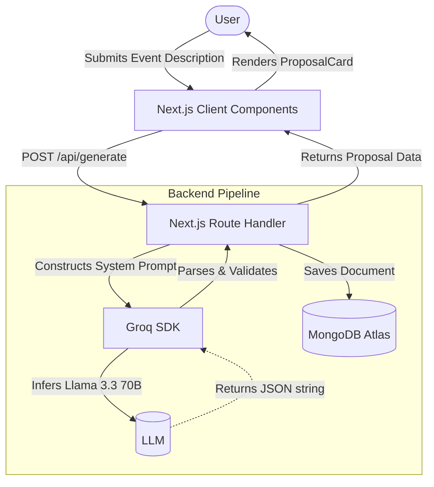

<div align="center">
  <!-- A placeholder for an actual logo -->
  <h1>🚢 AI Event Concierge</h1>
  <p><strong>An intelligent corporate event venue finder powered by Llama 3.3 and MongoDB.</strong></p>

  <p>Planning an executive retreat or a team offsite can take days of venue research. AI Event Concierge lets you describe your event in plain language, instantly returning a structured venue proposal with estimated costs and AI-backed justifications.</p>

  <p>
    
    
    
    
    
  </p>
</div>

---

## 📸 Screenshots

*(Visual assets are currently placeholders. The following screenshots would perfectly showcase the application.)*

| Landing Page | Venue Proposal |
|:---:|:---:|
| <div align="center"></div> | <div align="center"></div> |
| *The hero section with dynamic Framer Motion animations and quick-prompt cards.* | *The AI-generated proposal card with one-click copy and breakdown.* |
| **History Sidebar** | **Dark Mode** |
| <div align="center"></div> | <div align="center"></div> |
| *Slide-out sidebar containing previously generated and persisted proposals.* | *Native dark mode support utilizing `next-themes` and CSS variables.* |

---

## 🧩 The Problem

* **Venue hunting is tedious.** Finding a location that matches budget, team size, and vibe requires hours of Googling and requesting quotes.
* **Brainstorming lacks structure.** Event planners often start with a vague idea but struggle to translate it into a concrete location and budget expectation.
* **Chatbots are generic.** Standard AI chatbots provide unstructured text walls instead of actionable, shareable venue proposals.

## 💡 The Solution

AI Event Concierge streamlines the early stages of event planning:
* **Natural Language Input:** Simply describe the event ("A 2-day leadership retreat for 20 senior executives focused on strategy and alignment").
* **Structured Output:** The AI parses the request and returns a strictly formatted JSON object mapped to a beautiful UI card containing the Venue, Location, Cost, and Justification.
* **Persistent Workflow:** Every generated proposal is saved to a MongoDB database, ensuring no idea is lost if the tab is closed, and allowing past proposals to be retrieved and managed instantly.

---

## ✨ Features

| Feature | Description |
|:---|:---|
| 🤖 **AI Venue Proposals** | Uses Groq and `llama-3.3-70b-versatile` to process natural language into a structured venue recommendation. |
| 🗄️ **Persistent History** | Integrates with MongoDB to save every search automatically. Past proposals are loaded on the client via the `/api/history` route. |
| 📋 **One-Click Copy** | Instantly copies a neatly formatted text version of the proposal to the user's clipboard for easy sharing. |
| 🗑️ **History Management** | Allows users to delete individual proposals from their history, instantly reflecting in both the UI and the database. |
| 🎨 **Dynamic UI & Animations** | Employs Framer Motion for spring animations, cursor-reactive glow blobs, page transitions, and skeleton loaders. |
| 🌗 **Theme Support** | Fully responsive dark and light modes supported by `next-themes` and Tailwind CSS. |

---

## 🔄 How It Works



---

## 🏗 Architecture

The application implements a modern full-stack Next.js architecture, clearly separating presentation from business and database logic.

* **Frontend (Presentation):** React 19 Client Components (`app/page.tsx`, `components/`) handle the user interface, state management, and Framer Motion animations. Data fetching is performed via HTTP calls to internal API routes.
* **Backend (API Layer):** Next.js Route Handlers (`app/api/**`) act as a thin HTTP layer processing requests, validating input length, and orchestrating downstream services.
* **AI Integration:** The `lib/gemini.ts` file isolates the Groq SDK client. It constructs the system prompt, enforcing a strict JSON schema output from the LLM, and includes custom parsing logic to handle occasional markdown formatting in the LLM's response. *(Note: While the file is named `gemini.ts`, the implementation successfully leverages Groq's high-speed inference for Llama 3.3)*.
* **Data Persistence:** The `lib/mongodb.ts` file implements a singleton pattern to cache the Mongoose database connection across serverless function invocations, preventing connection exhaustion. The `EventProposal` model defines the schema.

---

## 🧱 Tech Stack

| Layer | Technology |
|---|---|
| **Framework** | Next.js 15.2 (App Router) |
| **Language** | TypeScript 5.9 |
| **Styling** | Tailwind CSS v4, `clsx`, `tailwind-merge` |
| **UI Components** | Radix UI Primitives (Dialog, Toast, Tooltip) |
| **Animations** | Framer Motion 12 |
| **Icons** | Lucide React |
| **Database** | MongoDB Atlas, Mongoose 9.7 |
| **AI Inference** | Groq (`groq-sdk`), Llama 3.3 70B |
| **Theming** | `next-themes` |
| **Deployment** | Vercel |

---

## 📂 Folder Structure

```text
ai-event-concierge/
├── src/
│   ├── app/
│   │   ├── api/
│   │   │   ├── generate/route.ts   # Proposal generation & Groq/DB integration
│   │   │   └── history/            # History retrieval and deletion endpoints
│   │   ├── globals.css             # CSS variables, glassmorphism utilities
│   │   ├── layout.tsx              # Root layout & ThemeProvider
│   │   └── page.tsx                # Main dashboard & Framer Motion logic
│   ├── components/                 # Reusable UI components (Sidebar, SearchForm)
│   ├── lib/
│   │   ├── gemini.ts               # Groq SDK configuration & prompt logic
│   │   ├── mongodb.ts              # Mongoose connection caching singleton
│   │   └── utils.ts                # Utility functions
│   ├── models/
│   │   └── EventProposal.ts        # Mongoose Schema definition
│   └── types/
│       └── event.ts                # Shared TypeScript interfaces
├── package.json
└── next.config.ts
```

---

## 🔬 Deep Technical Implementation

### AI Pipeline and Prompt Engineering
The application strictly requires structured JSON from the LLM to populate the React components. To achieve this:
1. **System Prompting:** The prompt in `lib/gemini.ts` explicitly commands the model to return *only* valid JSON, detailing the exact schema required (`venueName`, `location`, `estimatedCost`, `justification`).
2. **Resilient Parsing:** Even with strict prompts, LLMs sometimes wrap JSON in markdown code blocks. The code implements a fallback regex extractor (`cleaned.match(/\{[\s\S]*\}/)`) to safely extract the JSON payload if `JSON.parse` initially fails.
3. **Model Selection:** The application leverages `llama-3.3-70b-versatile` via Groq, chosen for its exceptional inference speed, reducing the time-to-first-byte for user queries.

### MongoDB Serverless Optimization
In a Next.js serverless environment (like Vercel), route handlers spin up and down frequently. If every request creates a new database connection, the MongoDB cluster's connection limit can be quickly exceeded.
The project mitigates this in `lib/mongodb.ts` by attaching the Mongoose connection promise to the `global` object. This ensures that across hot-reloads in development and warm-starts in production, the application reuses a single connection pool.

---

## 🚀 Installation and Local Development

### 1. Prerequisites
- **Node.js** 20+
- A **MongoDB Atlas** cluster (the free tier is sufficient).
- A **Groq** API key (get one at [console.groq.com](https://console.groq.com)).

### 2. Clone and Install
```bash
git clone <repository-url>
cd ai-event-concierge
npm install
```

### 3. Environment Configuration
Create a `.env.local` file in the root of the project:
```bash
touch .env.local
```
Add the following variables:
```env
MONGODB_URI=mongodb+srv://<username>:<password>@<cluster>.mongodb.net/ai-event-concierge?retryWrites=true&w=majority
GROQ_API_KEY=your_groq_api_key_here
```

### 4. Run the Development Server
```bash
npm run dev
```
Open [http://localhost:3000](http://localhost:3000) in your browser.

---

## 🔐 Environment Variables

| Variable | Required | Description | Exposure |
|---|:---:|---|---|
| `MONGODB_URI` | Yes | The connection string for the MongoDB Atlas database. | Server-only |
| `GROQ_API_KEY` | Yes | The API key for authenticating with the Groq inference engine. | Server-only |

*Note: No environment variables are exposed to the browser client (no `NEXT_PUBLIC_` prefix), ensuring API keys remain secure.*

---

## ⚡ Performance and UX Philosophy

* **Glassmorphism & Aesthetics:** The UI features a premium, modern design using CSS `backdrop-filter`, translucent borders, and subtle "shine" effects on cards to create depth.
* **Cursor-Reactive Glow:** The application implements dynamic, cursor-following glow blobs using Framer Motion's `useMotionValue` and `useSpring`, creating an engaging and "alive" background without compromising performance.
* **Optimistic Error Handling:** API errors (e.g., Groq timeouts or MongoDB connection issues) are gracefully caught and displayed to the user via a top-level `ErrorToast` component, avoiding unhandled promise rejections or white screens of death.
* **Input Validation:** The backend validates input length (between 10 and 2000 characters) before initiating costly LLM or database calls, preventing abuse and wasted compute.

---

## ⚖️ Differentiators

| Feature | Standard Search | AI Event Concierge |
|---|---|---|
| **Query Mechanism** | Keyword-based, multiple filters | Natural language description |
| **Result Format** | Long lists requiring manual review | Single, high-confidence proposal |
| **Contextualization** | None | Explains *why* the venue fits the prompt |
| **History** | Browser history (URLs) | Dedicated, persistent database UI |

---

## 🗺️ Roadmap

Future enhancements to elevate the platform:
- [ ] **Multi-Venue Options:** Allow the AI to return an array of 3 venues (Low, Medium, High budget) instead of a single proposal.
- [ ] **User Authentication:** Implement NextAuth or Supabase to allow personalized, multi-user accounts instead of a single global history.
- [ ] **Image Integration:** Connect to the Google Places API or Unsplash API to dynamically fetch and display a photo of the recommended venue.
- [ ] **Export Options:** Add functionality to export proposals as PDF files for easy sharing with stakeholders.

---

## 🤝 Acknowledgements

* Icons provided by [Lucide React](https://lucide.dev/).
* UI Primitives built on [Radix UI](https://www.radix-ui.com/).
* Fast LLM Inference powered by [Groq](https://groq.com/).
